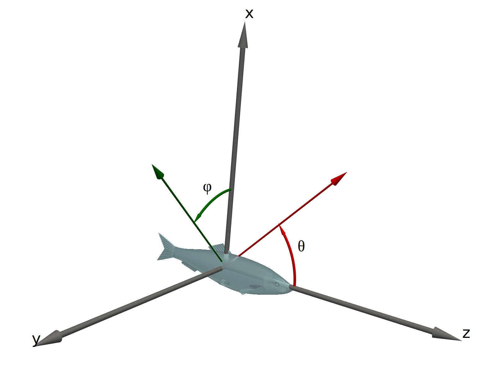

# Contributing to echoSMs

We welcome all contributions to echoSMs, be it code, test cases, bug reports, discussion of models, etc. Please use the [github](https://github.com/ices-tools-dev/echoSMs) facilities for this (i.e., [issues](https://github.com/ices-tools-dev/echoSMs/issues), [pull requests](https://github.com/ices-tools-dev/echoSMs/pulls), and [discussions](https://github.com/ices-tools-dev/echoSMs/discussions)). We are also happy to accept directly code that we can add to echoSMs on your behalf.

An objective of echoSMs is to provide scattering models in a form that is easy to access, use, and compare to other models. To help with that, we specify model parameter units, angle conventions, and required model outputs that code contributions should support. We also suggest coding conventions that should be followed.

## Units

We use SI units for the model parameters for model inputs and outputs, except for angles (degrees instead of radians) and target strength (use use deciBels).

| Parameter | Units | Notes |
|-----------|-------|--|
|length, diameter, radius, thickness, etc|m||
|density|kg/m³||
|sound speed|m/s||
|angle|°|[see below][coordinate-systems]|
|frequency|Hz||
|target strength|dB|reference value is 1 m²|

## Coordinate systems

A single coordinate system should be used for all models provided by echoSMs. The aim is to ease the comparison of results between different models.

The right-handed spherical coordinate system as defined by ISO 80000-2[^1] is to be used, where organisms are oriented such that _θ_ corresponds to pitch and _ɸ_ to roll, as illustrated below, where the organism lies along the _z_-axis and the positive _x_-axis extends above the organism:

<!--- This code will include an html file, originally used to
include a live 3D view of the coordinate system, but there are
issues with the html so for the moment a 2D image is used.

<iframe src="../coordinate_system2.html" title="Coordinate system" width="100%" height="500" frameborder="0"></iframe>

--->

{:style="height:400px;width400px"}

The definitions are such that _θ_ values of 0°, 90°, and 180° correspond to acoustic wave incidence angles of head on, dorsal, and tail on, respectively, and positive values of _ɸ_ indicate incidence angles from the positive _y_-axis side of the organism. Note that the definition of these angles is in terms of the acoustic wave, not the orientation of the organism. All model code should accept angles and produce results in this coordinate system. If the model calculations use a different coordinate system, the code should internally convert between the system given above and the version used in the code.

## Code style

Contributions of code should follow standardised or community-agreed styles and be provided in (or added to) a structure suitable for packaging and uploading to package libraries. For Python this includes `pip` and/or `conda`, for R this would be `CRAN`, for Matlab this would be a toolbox on the MATLAB File Exchange, etc.

Python code should follow [PEP8](https://peps.python.org/pep-0008) and docstrings should use [PEP257](https://peps.python.org/pep-0257/) with the contents following the [numpydoc style](https://numpydoc.readthedocs.io/en/latest/format.html). An exception to PEP8 is made to allow lines of up to 100 characters.

[^1]: [ISO. 2019.](https://www.iso.org/obp/ui/en/#iso:std:iso:80000:-2:ed-2:v2:en) ISO 80000-2. Part 2: Mathematics.
