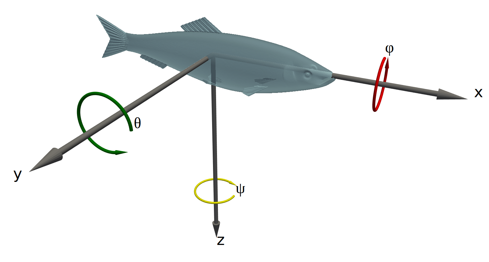

# Conventions

## Units

We use SI units for the model parameters, except for angles (we use degrees instead of radians) and target strength (we use deciBels).  All model code must accept inputs and produce results using the units below. If the model calculations use different units internally, the code should internally convert between them.

| Parameter | Units | Notes |
|-----------|-------|--|
|length, diameter, radius, thickness, etc|m||
|density|kg/m³||
|sound speed|m/s||
|angle|°|See [Coordinate systems][coordinate-systems]|
|frequency|Hz||
|target strength|dB|reference value is 1 m²|

## Coordinate systems

A single coordinate system is used for all models implemented by echoSMs. The aim is to ease the comparison of results between different models.

The right-handed spherical coordinate system as defined by ISO 80000-2[^1] is to be used, as illustrated below. The organism should lie along the _z_-axis with the positive _x_-axis extending above the dorsal surface of the organism:

<!--- This code will include an html file, originally used to
include a live 3D view of the coordinate system, but there are
issues with the html so for the moment a 2D image is used.

<iframe src="../coordinate_system2.html" title="Coordinate system" width="100%" height="500" frameborder="0"></iframe>

--->

{:style="height:400px;width400px"}

Note: the figure above is not correct (see [issue 26](https://github.com/ices-tools-dev/echoSMs/issues/26)).

The definitions are such that for _ɸ_=0°, _θ_ values of 0°, 90°, and 180° correspond to acoustic wave incidence angles of head on, dorsal, and tail on, respectively. Note that the definition of these angles is in terms of the acoustic wave, not the orientation of the organism (which should always be as shown in the illustration).

All model code should accept angles and produce results in this coordinate system. If the model calculations use a different coordinate system, the code should internally convert between the system given above and the version used in the code.

## Code style

Contributions of code should follow standardised or community-agreed styles and be provided in (or added to) a structure suitable for packaging and uploading to package libraries. For Python this includes `pip` and/or `conda`, for R this would be `CRAN`, for Matlab this would be a toolbox on the MATLAB File Exchange, etc.

Python code should follow [PEP8](https://peps.python.org/pep-0008) and docstrings should use [PEP257](https://peps.python.org/pep-0257/) with the contents following the [numpydoc style](https://numpydoc.readthedocs.io/en/latest/format.html). An exception to PEP8 is made to allow lines of up to 100 characters.

[^1]: [ISO. 2019.](https://www.iso.org/obp/ui/en/#iso:std:iso:80000:-2:ed-2:v2:en) ISO 80000-2. Part 2: Mathematics.
