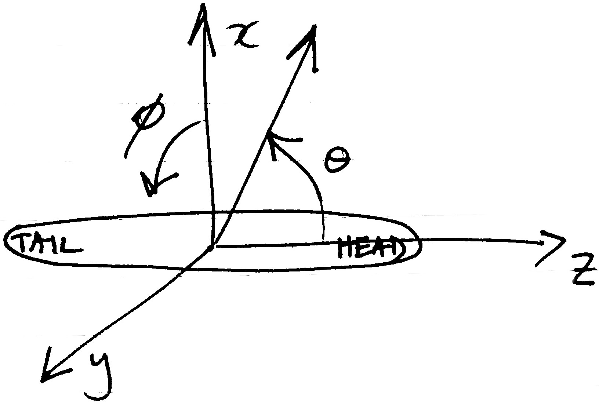

# Contributing to echoSMs

We welcome all contributions to echoSMs, be it code, test cases, bug reports, discussion of models, etc. Please use the github facilities for this (i.e., issues and pull-requests). We are also happy to accept directly code that we can add to echoSMs on your behalf.

An objective of echoSMs is to provide scattering models in a form that is easy to access, use, and compare to other models. To help with that, we specify model parameter units, angle conventions, and required model outputs that code contributions should support. We also suggest coding conventions that should be followed. 

## Units
We use SI units for the model parameters and do not use SI prefixes for model inputs and outputs. The two exceptions to this are the use of degrees rather than radians for angles and the use of deciBels for target strength. 
| Parameter | Units | Notes |
|-----------|-------|--|
|length, diameter, radius, thickness, etc|m||
|density|kg/m³||
|sound speed|m/s||
|angle|°|See below for angle conventions|
|frequency|Hz||
|target strength|dB|reference value is 1 m²|

## Coordinate systems

A single coordinate system should be used for all models provided by echoSMs. The aim is to ease the comparison of results between different models.

The right-handed spherical coordinate system as defined by ISO 80000-2[1] is to be used, where organisms are oriented such that θ corresponds to pitch and ɸ to roll, as illustrated below, where the organism lies along the z-axis and the positive x-axis extends above the organism:

The definitions are such that θ values of 0°, 90°, and 180° correspond to organism pitches of head on, dorsal, and tail on, respectively, and positive values of ɸ indicate a roll to starboard. All model code should accept angles and produce results in this coordinate system. If the model calculations use a different coordinate system, the code should internally convert between the system given above and the version used in the code.

## Code style
Contributions of code should follow standardised or community-agreed styles and be provided in (or added to) a structure suitable for packaging and uploading to package libraries. For Python this includes `pip` and/or `conda`, for R this would be `CRAN`, for Matlab this would be a toolbox on the MATLAB File Exchange, etc.

Python code should follow [PEP8](https://peps.python.org/pep-0008) and docstrings should use [PEP257](https://peps.python.org/pep-0257/) with the contents following the [numpydoc style](https://numpydoc.readthedocs.io/en/latest/format.html).

# References
1. ISO. 2019. ISO 80000-2. Part 2: Mathematics. https://www.iso.org/obp/ui/en/#iso:std:iso:80000:-2:ed-2:v2:en.

