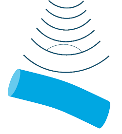
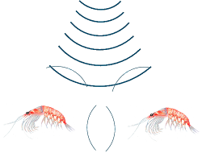
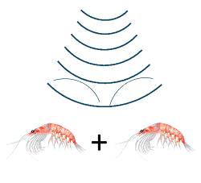

# Selecting a scattering model

???+ Note

    This page contains work originally developed for the scatmod project, an earlier effort to distribute and develop acoustic scattering models. Scatmod is currently available in a github [repository](https://github.com/SvenGastauer/scatmod), but may be deleted in the future. To ensure the model selection part of the scatmod documentation remains available, it is reproduced here (with some edits and additions).

    Scatmod was developed and maintained by members of the [ICES WGFAST group](https://www.ices.dk/community/groups/Pages/WGFAST.aspx) originating from various institutes including [NWFSC NOAA](https://www.nwfsc.noaa.gov/), [Scripps Institute Of Oceanography](https://scripps.ucsd.edu/), [St Andrews University](https://risweb.st-andrews.ac.uk/portal/en/organisations/school-of-biology(a348f890-b967-4e22-a8ae-75e33143747f).html), [NIWA](https://www.niwa.co.nz/our-science/coasts-and-oceans) and [CMR](https://www.cmr.no/). The primary authors were Sven Gastauer, Dezhang Chu, Roland Proud, Yoann Ladroit, Geir Pedersen, and Pablo Escobar-Flores.

## Types of scattering models

There are three major categories of scattering model relevant to fisheries acoustics:

### Analytic/semi-analytic models

- _Application_
    - Simple geometric shapes (e.g. spheres, cylinders, prolate spheroids)
- _Models_
    - Modal serial solution (MSS)
    - Prolate spheroidal modal series (PSMS)
- _Advantages_
    - Exact (mostly)
    - Fast
    - Few restrictions on frequency and material properties
- _Disadvantages_
    - Not possible to model complex or realistic targets
    - Assumes a single scattering object

/// caption
///

### Numerical models

- _Application_
    - Arbitrary shapes, frequencies and materials
- _Models_
    - Finite Element Method (FEM)
    - Boundary Element Method (BEM)
    - Combinations of BEM and FEM
- _Advantages_
    - Allows for modelling of complex shapes and internal structures
    - Can include diffraction and fluid/structure interactions
    - Can be applied to arbitrary materials and frequencies
- _Disadvantages_
    - Computationally complex and expensive

/// caption
///

### Approximate models

- _Application_
    - Various scattering surface and orientations for a range of frequencies (model dependent)
- _Models_
    - Kirchhoff Ray Mode (KRM)
    - Kirchhoff Approximation (KA)
    - Distorted Wave Born Approximation (DWBA)
    - Deformed Cylinder Model (DCM)
    - High-pass models (HP)
    - Method of Fundamental Solutions (MFS)
    - Resonant Scattering
- _Advantages_
    - Can represent arbitrary scattering surface and orientations
    - Fast and relatively simple
- _Disadvantages_
    - Frequency restrictions for some models
    - Does not include diffraction effects or internal structure implicitly
    - Multibody scattering generally assumed to be linearly additive

/// caption
///

## Which model to use?

The choice of a model depends on the type of object you want to estimate the scattering from, the material properties, the acoustic frequencies, what accuracy is needed, and how long you are prepared to wait for a model to run.

Below are sections for the common types of modelled objects with suggested model types for them and selected papers that present the model or provide information about the model performance. Below that is a table that provides an overview of model abilities and constraints.

### Gas bubbles or swimbladders

- Best
    - Numerical models for complex shapes e.g. BEM, FEM
    - Analytical solutions for simple shapes
 - Easier
    - Resonance scattering: Find the resonance frequency, high frequencies for small bubbles, low frequencies for swimbladders
    - KRM: Limited to high frequencies, can be used for flesh and swimbladder if swimbladdered fish are to be modelled

### Bones

- Best
    - Numerical models for complex shapes e.g. BEM, FEM
    - Analytical solutions for simple shapes
- Easier
    - DCM
 
### Fluid-like/flesh  

- Best
    - Numerical models for complex shapes e.g. BEM, FEM
    - Analytical solutions for simple shapes
- Easier
    - DCM
    - DWBA
    - KRM

### Model properties and constraints

This table is a modified version of that in [Jech et al. (2015)](https://doi.org/10.1121/1.4937607) and gives properties and constraints for the models in that paper.

|Model|Accuracy/Type|Range of validity|Limitations|Examples|
|---|---|---|---|---|
|MSS|Exact/Analytical|Canonical shapes|Convergence issues with some shapes|Anderson (1950)|
|BEM|Quasi-exact / Numerical|All shapes, all frequencies, all angles|High computational demands (slightly better with Fast-Multipole BEM)|Francis et al. (1998); Francis and Foote (2003);  Okumura et al. (2003)|
|FEM|Quasi-exact / Numerical|All shapes, all frequencies, all angles|High computational demands|Zampolli et al. (2007); Macaulay et al. (2013)|
|FMM|Exact / Analytical|If Axisymmetric - all shapes, all frequencies, all angles|Non-axisymmetric, convergence issues at high aspect ratios|Reeder and Stanton (2004)|
|KA|Approximate|High frequencies only, near normal incidence, homogenous material|Off-normal incidence, low frequencies, no circumferential waves|Macaulay et al. (2013)|
|KRM|Approximate|All frequencies, homogenous material; at high frequencies: high aspect ratios; at low frequencies: near-normal incidence|Off-normal incidence, no circumferential waves, no longitudinal modes of vibration near resonance|Horne et al. (2000); Macaulay et al. (2013); Gastauer et al. (2016)|
|Modal series based DCM|Approximate|Near normal incidence; all frequencies; circular cross-sections; all material|Off-normal incidence, low aspect ratios, irregular shapes with high local slopes|Gorska and Ona (2003); Stanton (1989)|
|DWBA (incl PT-DWBA,SDWBA)|Approximate|Weak scatterers (g and h < 1.005 i.e. < 5%), all shapes, all angles|Strong scatterers (g and h > 5%)|Chu and Ye (1999); Demer et al. (2003); Calise and Skaret (2011); Gastauer et al. (2019)|

## Multiscattering

_This section is not complete._

The idea is to talk about the different options to model multiscattering, e.g. simple linear addition, the case of bubbles, the more complex cse of reality (mention possible methods and BEM/FEM options)

## List of model name acronyms

- MSS - Modal Series Solutions  
- BEM - Boundary Element Model  
- FEM - Finite Element Model  
- FMM - Fourier Matching Method  
- KA - Kirchhoff Approximation  
- DCM - Deformed Cylinder scattering Model
- DWBA - Distorted Wave Born Approximation

## References

The references are grouped by the model type that they contain. A single paper can appear under multiple model types.

__BEM, FEM__
: 
    - _Francis, D. T., Foote, K. G., Alippi, A., & Cannelli, G. B. (1998). ‘Boundary-element-model predictions of acoustic scattering by swimbladder-bearing fish. In Proceedings of the Fourth European Conference on Underwater Acoustics (Vol. 1, pp. 255-260). Rome: CNR-IDAC._  
    - _Francis, D. T., & Foote, K. G. (2003). Depth-dependent target strengths of gadoids by the boundary-element method. The Journal of the Acoustical Society of America, 114(6), 3136-3146._  
    - _Macaulay, G. J., Peña, H., Fässler, S. M., Pedersen, G., & Ona, E. (2013). Accuracy of the Kirchhoff-approximation and Kirchhoff-ray-mode fish swimbladder acoustic scattering models. PloS one, 8(5), e64055._
    - _Okumura, T., Masuya, T., Takao, Y., & Sawada, K. (2003). Acoustic scattering by an arbitrarily shaped body: An application of the boundary-element method. ICES Journal of Marine Science, 60(3), 563-570._  
    - _Zampolli, M., Tesei, A., Jensen, F. B., Malm, N., & Blottman III, J. B. (2007). A computationally efficient finite element model with perfectly matched layers applied to scattering from axially symmetric objects. The Journal of the Acoustical Society of America, 122(3), 1472-1485._

__Analytical Solutions__
: 
    -  _Anderson, V. C. (1950). Sound scattering from a fluid sphere. The Journal of the Acoustical Society of America, 22(4), 426-431._
    - _Gastauer, S., Chu, D., & Cox, M. J. (2019). ZooScatR—An r package for modelling the scattering properties of weak scattering targets using the distorted wave Born approximation. The Journal of the Acoustical Society of America, 145(1), EL102-EL108._

__Resonance Scattering__
: 
    - _Godø, O. R., Patel, R., & Pedersen, G. (2009). Diel migration and swimbladder resonance of small fish: some implications for analyses of multifrequency echo data. ICES Journal of Marine Science, 66(6), 1143-1148._
    - _Holliday, D. V. (1972). Resonance structure in echoes from schooled pelagic fish. The Journal of the Acoustical Society of America, 51(4B), 1322-1332._
    - _Love, R. H. (1978). Resonant acoustic scattering by swimbladder‐bearing fish. The Journal of the Acoustical Society of America, 64(2), 571-580._
    - _McCartney, B. S., & Stubbs, A. R. (1971). Measurements of the acoustic target strengths of fish in dorsal aspect, including swimbladder resonance. Journal of Sound and Vibration, 15(3), 397-420._

__KRM__
: 
    - _Gastauer, S., Scoulding, B., Fässler, S. M., Benden, D. P., & Parsons, M. (2016). Target strength estimates of red emperor (Lutjanus sebae) with Bayesian parameter calibration. Aquatic Living Resources, 29(3), 301._
    - _Hazen, E. L., & Horne, J. K. (2004). Comparing the modelled and measured target-strength variability of walleye pollock, Theragra chalcogramma. ICES Journal of Marine Science, 61(3), 363-377._
    - _Horne, J. K., Walline, P. D., & Jech, J. M. (2000). Comparing acoustic model predictions to in situ backscatter measurements of fish with dual‐chambered swimbladders. Journal of fish Biology, 57(5), 1105-1121._
    - _Horne, J. K. (2003). The influence of ontogeny, physiology, and behaviour on the target strength of walleye pollock (Theragra chalcogramma). Ices Journal of marine science, 60(5), 1063-1074._
    -  _Macaulay, G. J., Peña, H., Fässler, S. M., Pedersen, G., & Ona, E. (2013). Accuracy of the Kirchhoff-approximation and Kirchhoff-ray-mode fish swimbladder acoustic scattering models. PloS one, 8(5), e64055._

__KA__
: 
    - _Foote, K. G. (1985). Rather‐high‐frequency sound scattering by swimbladdered fish. The Journal of the Acoustical Society of America, 78(2), 688-700._  

__DWBA__
: 
    - _Calise, L., and Skaret, G. (2011). “Sensitivity investigation of the SDWBA Antarctic krill target strength model to fatness, material contrasts and orientation,” Ccamlr Science 18, 97–122._  
    - _Chu, D., and Ye, Z. (1999). “A phase-compensated distorted wave born approximation representation of the bistatic scattering by weakly scattering objects: Application to zooplankton,” J. Acoust. Soc. Am.106, 1732–1743._
    - _Demer, D. A., and Conti, S. G. (2003). “Reconciling theoretical versus empirical target strengths of krill: Effects of phase variability on the distorted-wave Born approximation,” ICES J. Mar. Sci. 60, 429–434._  

__FMM__
: 
    - _Reeder, D. B., & Stanton, T. K. (2004). Acoustic scattering by axisymmetric finite-length bodies: An extension of a two-dimensional conformal mapping method. The Journal of the Acoustical Society of America, 116(2), 729-746._  

__Other relevant references__
: 
    - _Chu, D., Foote, K. G., & Stanton, T. K. (1993). Further analysis of target strength measurements of Antarctic krill at 38 and 120 kHz: Comparison with deformed cylinder model and inference of orientation distribution. The Journal of the Acoustical Society of America, 93(5), 2985-2988._  

    - _Gauthier, S., & Horne, J. K. (2004). Acoustic characteristics of forage fish species in the Gulf of Alaska and Bering Sea based on Kirchhoff-approximation models. Canadian Journal of Fisheries and Aquatic Sciences, 61(10), 1839-1850._

    - _Faran Jr, J. J. (1951). Sound scattering by solid cylinders and spheres. The Journal of the acoustical society of America, 23(4), 405-418._  

    - _Horne, J. K., Walline, P. D., & Jech, J. M. (2000). Comparing acoustic model predictions to in situ backscatter measurements of fish with dual‐chambered swimbladders. Journal of fish Biology, 57(5), 1105-1121._  

    - _Jech, J. M., Horne, J. K., Chu, D., Demer, D. A., Francis, D. T., Gorska, N., ... & Reeder, D. B. (2015). Comparisons among ten models of acoustic backscattering used in aquatic ecosystem research. The Journal of the Acoustical Society of America, 138(6), 3742-3764._  

    - _Stanton T.K. Sound scattering by cylinders of finite length. III. Deformed cylinders, Journal of the Acoustical Society of America, 1989, vol. 86 (pg. 691-705)_
